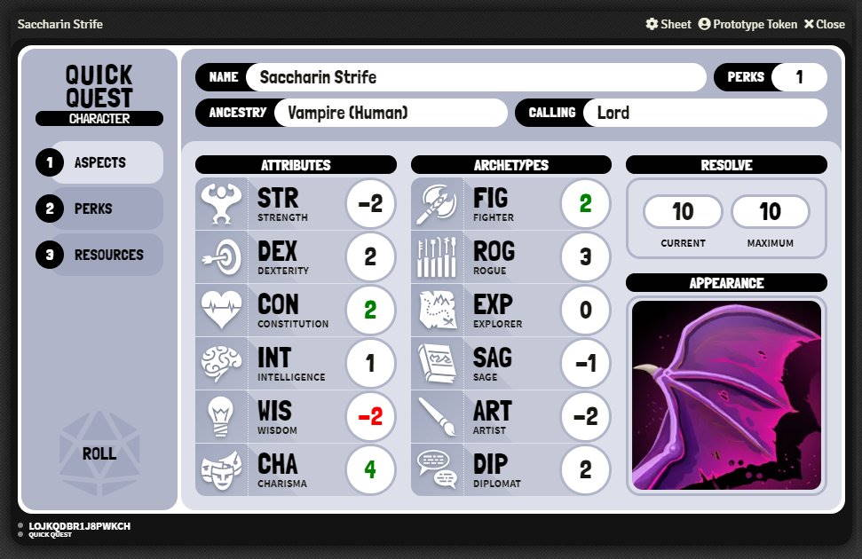
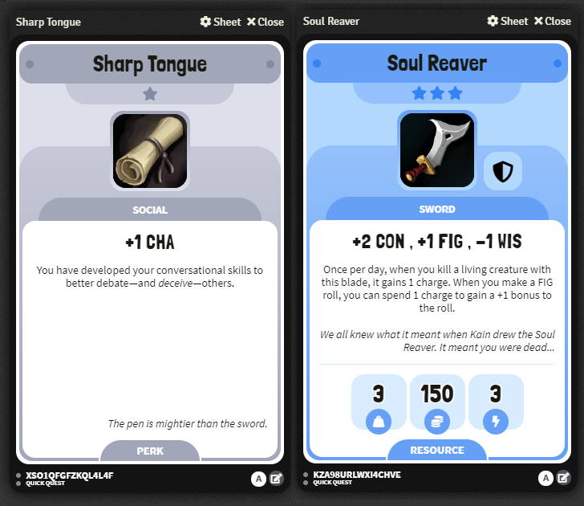

# Foundry Quick Quest

Want to play [Giffyglyph's Quick Quest](https://github.com/giffyglyph/giffyglyphs-quick-quest) in [Foundry VTT](https://foundryvtt.com/)? No worries—**Foundry Quick Quest** has you covered! Start playing a rules-lite RPG in minutes with a fully-featured character sheet, item cards, and perk system.

## Features

* A fully-featured character sheet.
* Resource and perk items with 5 tiers of rarity—common, uncommon, rare, epic, and legendary.
* Quick-roll mechanics.

## Getting Started

1. Install and activate the system.
   * System URL: https://raw.githubusercontent.com/giffyglyph/foundry-quick-quest/master/system.json
2. Create a new **Actor**. Customise your actor by setting the attributes and archetypes.
4. Create a new **Resource** item. Customise it and drag it onto your actor.
5. Create a new **Perk** item. Customise it and drag it onto your actor.

## Roadmap

To see what's being worked on right now—and what may be planned for the future—check out the **[projects board](https://github.com/giffyglyph/foundry-quick-quest/projects)**.

## Bugs and Feature Suggestions

If you notice a bug or have a feature suggestion, visit the **[issue board](https://github.com/giffyglyph/foundry-quick-quest/issues)** and open a ticket. Please make sure to be as thorough as possible in your report and attach screenshots where appropriate, as low-effort tickets may be closed out-of-hand.

## Support

If you'd like to see more from this module in future, please consider [becoming a patron](https://www.patreon.com/giffyglyph). You can also find more of my work at:

* [giffyglyph.com](https://giffyglyph.com)
* [twitter](https://twitter.com/giffyglyph)
* [twitch.tv/giffyglyph](https://twitch.tv/giffyglyph)

## Licensing

This module is licensed under the [Foundry Virtual Tabletop EULA: Limited License Agreement for module development](https://foundryvtt.com/article/license/).